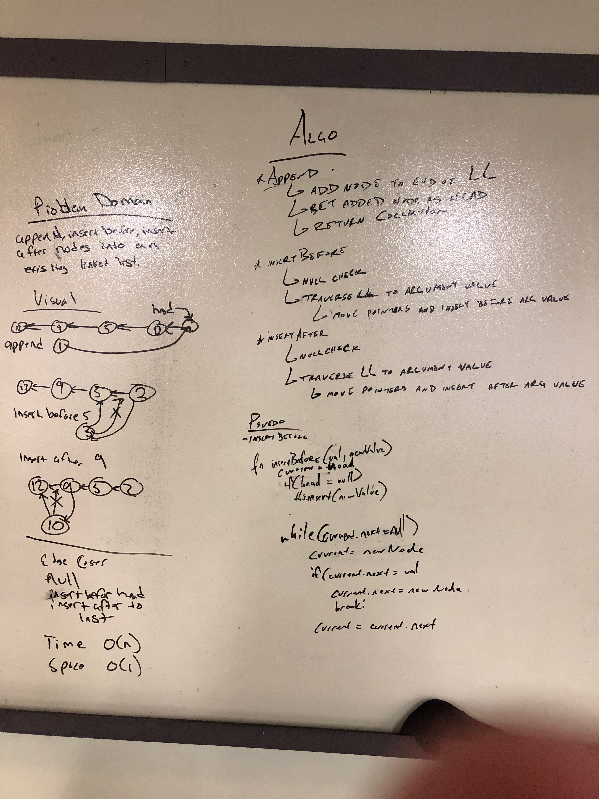
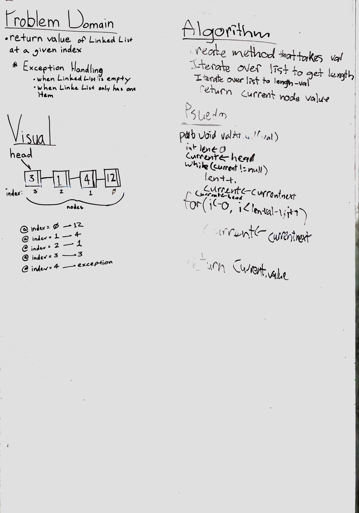

# Singly Linked List

## Challenge
Create a single linked list that can insert new nodes, can check values of nodes returning a boolean, and printing the linked list

## Approach & Efficiency
Create methods per docs then the Linked in constructor. Then created the Node class with it's constructor. Fleshed out the insert method, the includes method, and the print method. Finally wrote test to check the includes, and print methods

## API
insert method
  - to add new nodes
includes method 
  - to check for values in list
print method
  - to return linked list
append method
    - add to end of linked list
insert after method
    - insert node after given index value
insert before method
    - insert node before given index value
valueAtNthFromEnd
    - return the value from the end of a linked list given an index

## Whiteboard

