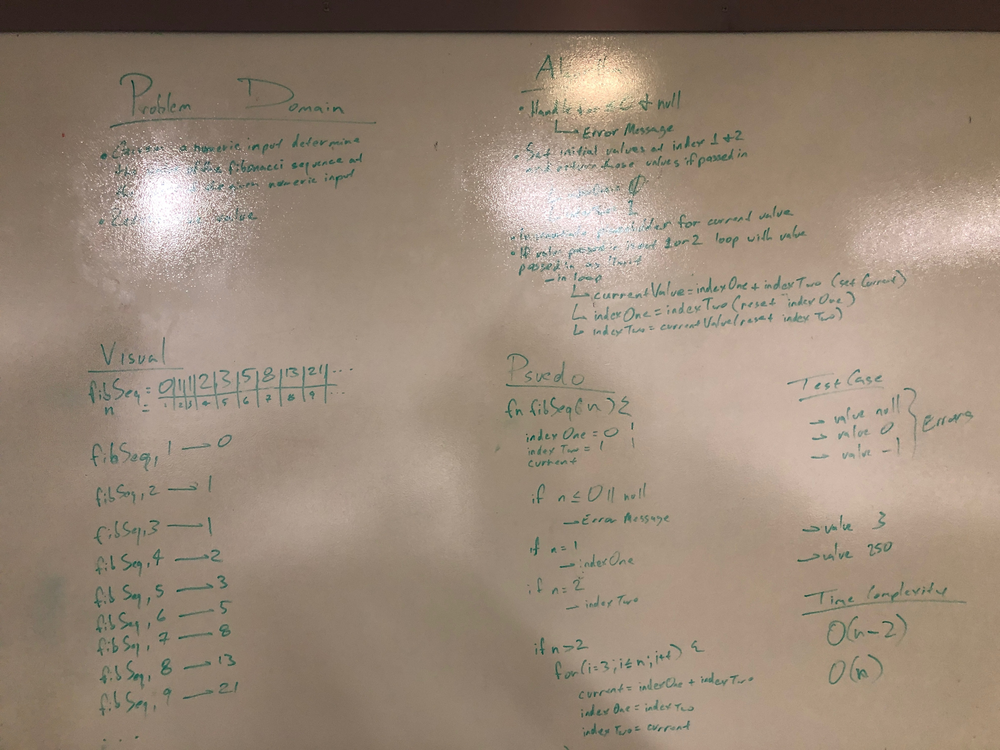
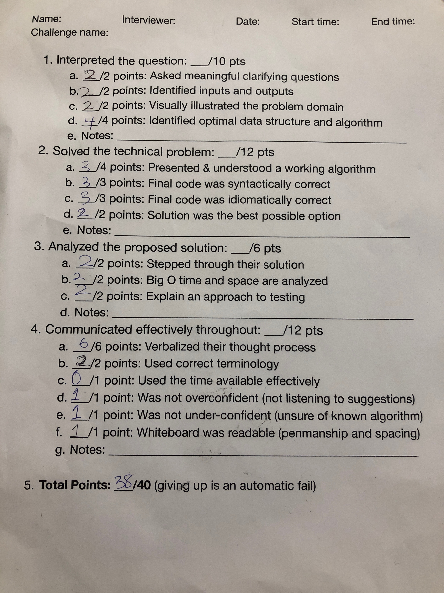

# Challenge Title
Mock Interview

## Challenge Description
Conduct a whiteboard challenge as a mock interview trying to solve the fibonacci sequence.

## Approach & Efficiency
Determine the start index and the last index. Then loop over while the end is not equal to or less than the start index. Determine the midpoint of the array and perform checks to determine if the num exist in the array. This is O(log n) time.

## Solution

