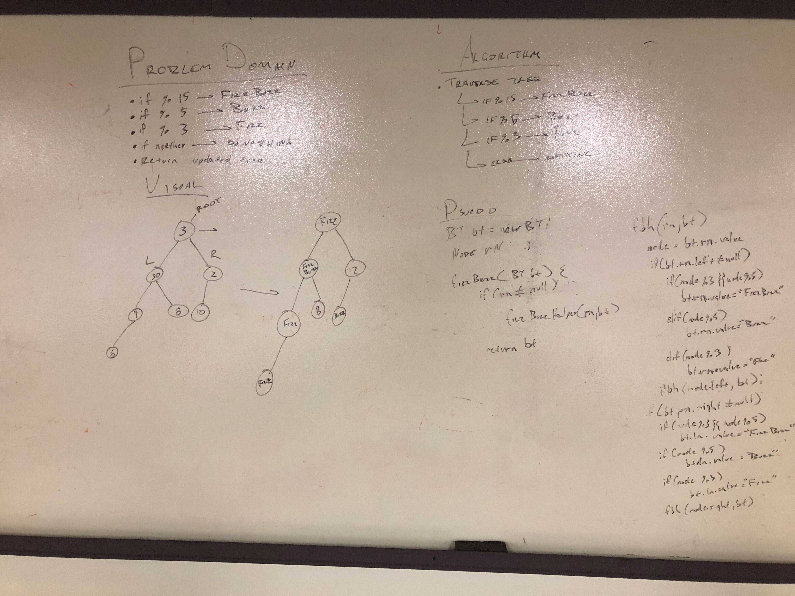

# Fizz Buzz Trees

## Challenge
Create a new fizz buzz tree that modifes the node based on the value:
3 && 5 -> FizzBuzz
5 -> Buzz
3 -> Fizz

## Approach & Efficiency
Apply a terversal method and change the values based on a given value

## API
fizzBuzzCheck
fizzBuzzCheckHelper

## Whiteboard
