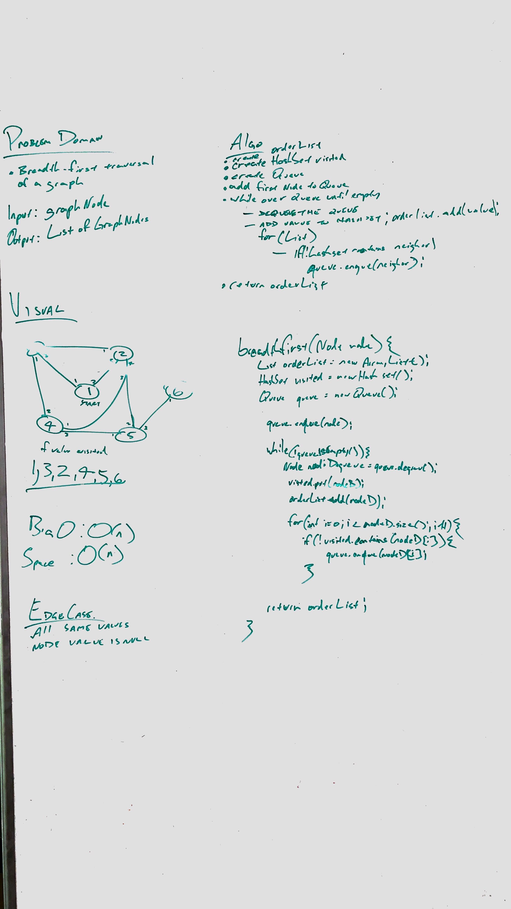

# Graphs

## Challenge
Create a graph with various methods

## Approach & Efficiency
Set up the Node with the required variables

## API

### Graph
- addGraphNode
- addEdge
- getNeighbors
- size
- getGraphNodes
- setGraphNodes
- breadthFirst
- depthFirst
- flightDestination

### Graph Node
- addNeighbor
- getLabel
- setLabel
- getNeighbors
- setNeighbors

## Whitboard

