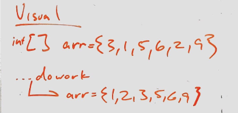

# Lecture Notes: Insertion Sort
This is an algorithm that takes in an unsorted array and sorts it.

Worst case scenario is O(n^2) which is not efficient. However it allows taking in an array and transforming in place.

## Learning Objectives
To learn how to write a method that sorts an array.

## Visual Representation

## Algorithm
Describe in detail how the algorithm works. Include small code snippets to possibly support the points

## Pseudocode
    InsertionSort(int[] arr)

      FOR i = 1 to arr.length

        int j <-- i - 1
        int temp <-- arr[i]

        WHILE j >= 0 AND temp < arr[j]
          arr[j + 1] <-- arr[j]
          j <-- j - 1

        arr[j + 1] <-- temp

## Readings and References
### Watch

Video

###Read

Article 1
Article 2
Bookmark

Website