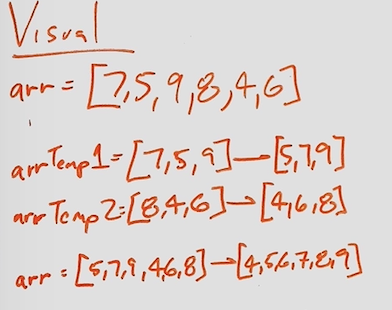
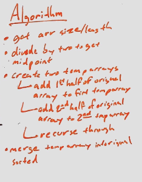
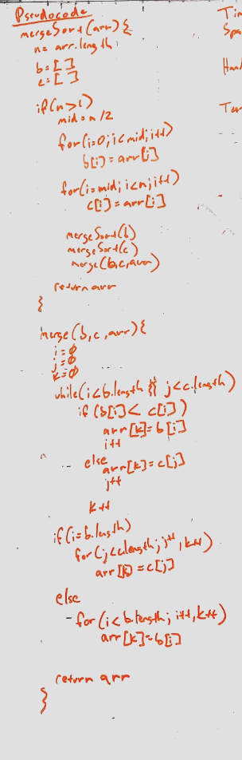

# Lecture Notes: Insertion Sort
This is an algorithm that takes in an unsorted array and sorts it.

By splitting an array with a merge sort we can reduce the time complexity of an insertion sort form O(n^2)  to O(n), and still being able to take in an array and transforming in place.

## Learning Objectives
To learn how to write a method that sorts an array with merge sort.

## Visual Representation

## Algorithm

## Pseudocode

## Readings and References
### Watch
(Merge Sort Video)[https://www.youtube.com/watch?v=JSceec-wEyw]

### Read

(Article 1)[https://www.geeksforgeeks.org/merge-sort/]
(Article 2) [https://www.baeldung.com/java-merge-sort]