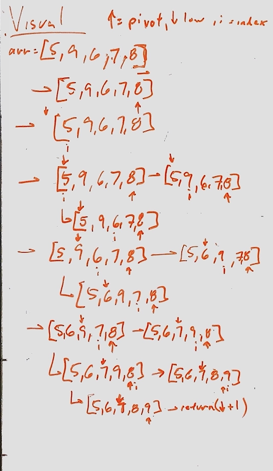
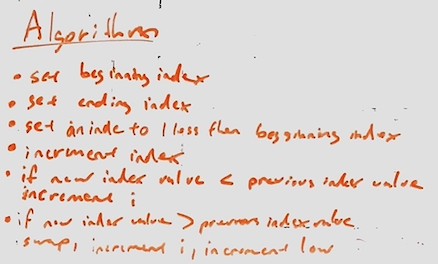

# Lecture Notes: Insertion Sort
This is an algorithm that takes in an unsorted array and sorts it.

## Learning Objectives
To learn how to write a method that sorts an array with quick sort.

## Visual Representation

## Algorithm

## Pseudocode

## Readings and References
### Watch
(Quick Sort Video)[https://www.youtube.com/watch?v=PgBzjlCcFvc]

### Read

(Article 1)[https://www.geeksforgeeks.org/quick-sort/]
(Article 2) [https://www.baeldung.com/java-quicksort]