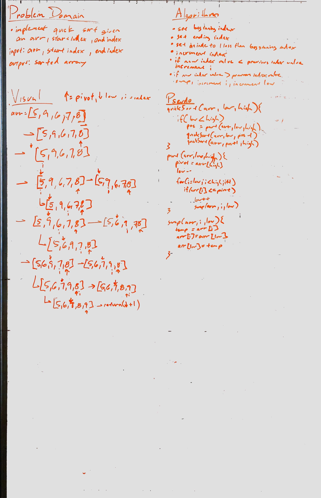

# Challenge Name
Insertion Sort Lesson Plan

## Challenge Description
Given psuedo code of quick sort, write code in Java with Test and develop Lesson Plan.

## Approach & Efficiency
Psuedocode was provided. Time: O(n^2), Space: O(n)

## Solution
